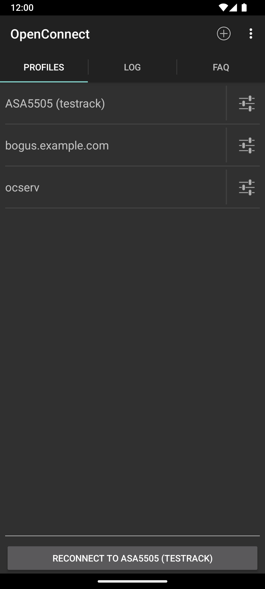
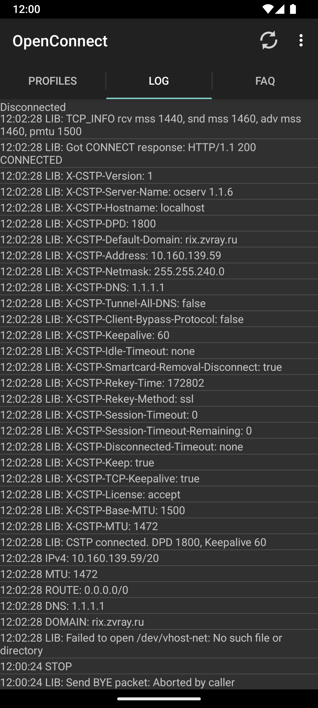
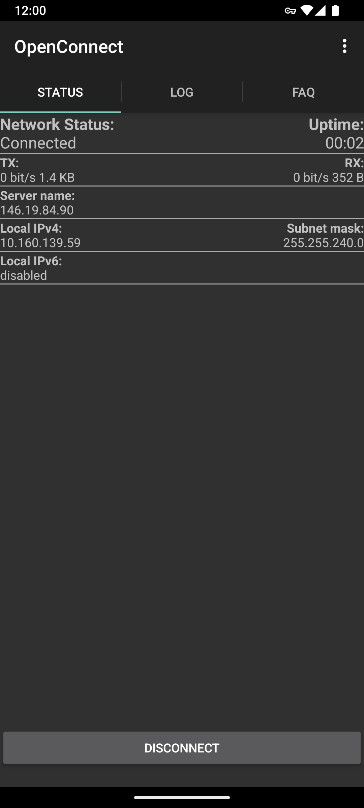
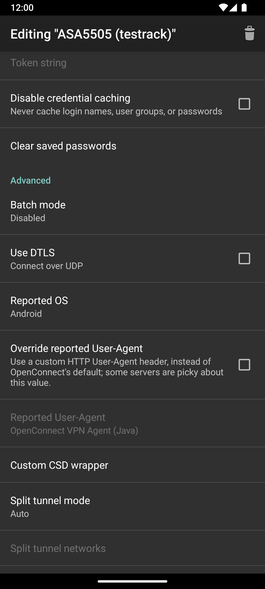
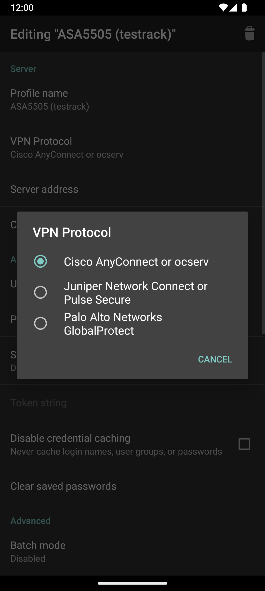

OpenConnect for Android
=======================

### NOTE

**There are no official openconnect packages in the Google Play Store.**  
Get involved (see #1) to release the Android client.

---

Multi-protocol version, based on [openconnect](http://www.infradead.org/openconnect).

XDA thread: [comment](https://forum.xda-developers.com/showthread.php?p=77318683#post77318683)

This is a VPN client for Android, based on the Linux build of
[OpenConnect](http://www.infradead.org/openconnect/).

Much of the Java code was derived from [OpenVPN for Android](https://play.google.com/store/apps/details?id=de.blinkt.openvpn&hl=en) by Arne Schwabe.

OpenConnect for Android is released under the GPLv2 license.  For more
information see the [COPYING](COPYING) and [doc/LICENSE.txt](misc/doc/LICENSE.txt)
files.

Changelog: see [doc/CHANGES.txt](misc/doc/CHANGES.txt)

## Downloads and support

You can download the latest release from the GitLab [releases](https://gitlab.com/openconnect/ics-openconnect/-/releases) page directly. F-Droid listing is comming soon.

## Screenshots

||||||
|---|---|---|---|---|

## Building from source

The application currently uses `minSdk 23` (Android 6), `targetSdk 34`, and
`compileSdk 35`. JDK 17 is required by the Android Gradle Plugin used by this
project.

### Prerequisites

The Android application build requires:

* a 64-bit Linux host;
* JDK 17;
* Gradle 8.10.2 (normally supplied by the Gradle wrapper);
* Android SDK command-line tools;
* SDK packages `"platform-tools"`, `"build-tools;34.0.0"`, and
  `"platforms;android-35"`;
* NDK r27c when rebuilding native dependencies;
* host-side `git`, `gcc`, `make`, `autoconf`, `automake`, `libtool`,
  `pkg-config`, `autopoint`, `gettext`, `bison`, and `flex`.

On Debian or Ubuntu, install the host-side build tools with:

```sh
sudo apt install autoconf automake autopoint bison build-essential flex \
    gettext libtool pkg-config
```

`ANDROID_HOME` must point to the Android SDK. `JAVA_HOME` must point to JDK 17.
The SDK's `platform-tools` and `cmdline-tools/latest/bin` directories must be
available in `PATH`.

### Project-local development environment

To avoid changing the host's system Java or Android installation, the preferred
development setup for this repository keeps downloaded tools under the ignored
`.devtools/` directory:

```text
.devtools/
├── jdk-17/
├── android-sdk/
│   └── ndk/27.2.12479018/
└── gradle-home/
```

An environment activation script should set the following variables only for
the current shell:

```sh
export JAVA_HOME="$PWD/.devtools/jdk-17"
export ANDROID_HOME="$PWD/.devtools/android-sdk"
export GRADLE_USER_HOME="$PWD/.devtools/gradle-home"
export ANDROID_USER_HOME="$PWD/.devtools/android-user-home"
export ANDROID_NDK_HOME="$ANDROID_HOME/ndk/27.2.12479018"
export PATH="$JAVA_HOME/bin:$ANDROID_HOME/cmdline-tools/latest/bin:$ANDROID_HOME/platform-tools:$PATH"
```

Bootstrap and activate this local environment with:

```sh
scripts/bootstrap-dev-env.sh
source scripts/dev-env.sh
scripts/build-native-dependencies.sh
```

Run the standard verification sequence with:

```sh
scripts/verify.sh
```

### Signed release APK

Release builds use a project-local keystore and an ignored
`release.properties` file. Create the keystore once, keep an external backup,
then copy `release.properties.example` to `release.properties` and fill in the
four signing values. Neither file containing secrets may be committed.

Build and verify the signed release APK with:

```sh
scripts/build-release.sh
```

The resulting APK is written to
`app/build/outputs/apk/release/openconnect-split-1.13.apk`.

Do not commit `.devtools/`, `local.properties`, downloaded SDK components,
Gradle caches, APK/AAB files, or signing credentials. The native libraries,
the standalone curl executable, and Java wrapper JARs are generated locally
from the source trees under `external/`. Their transitive source archives are
downloaded from the versioned URLs in `external/openconnect/android/Makefile`
and verified there with pinned SHA-256 hashes. The build does not copy native
artifacts from another APK and does not use the legacy public binary cache.

To build only one ABI while iterating, pass its internal architecture name:

```sh
scripts/build-native-dependencies.sh arm64
```

The default build produces `arm` (ARMv7, for older 32-bit Android 6 devices)
and `arm64` artifacts. The optional `x86` and `x86_64` names are supported for
legacy emulators but are not included by default. Pass them explicitly only
when those emulator ABIs are required.

If you encounter any issues, take a look at [`misc/Dockerfile`](https://gitlab.com/openconnect/ics-openconnect/-/blob/master/misc/Dockerfile).

### Compiling the external dependencies

Building OpenConnect from source requires compiling several .jar files and
native binaries from external packages.  These commands will build the binary
components and copy them into the appropriate library and asset directories:

```sh
git clone --recursive https://gitlab.com/openconnect/ics-openconnect
cd ics-openconnect
make -C external
```

This procedure only runs on a Linux PC.  If you are unable to build from
source, you can try fetching the cached artifacts from a recent [CI build](https://gitlab.com/openconnect/ics-openconnect/-/pipelines).


### Compiling the app

After the binary components are built, this compiles the Java sources into
an APK file:

```sh
cd ics-openconnect
./gradlew assembleDebug
```

To install the APK on a device:

    adb install -r app/build/outputs/apk/debug/app-debug.apk

Logs of successful (and not-so-successful) builds can be found on this project's
[CI page](https://gitlab.com/openconnect/ics-openconnect/-/pipelines).
